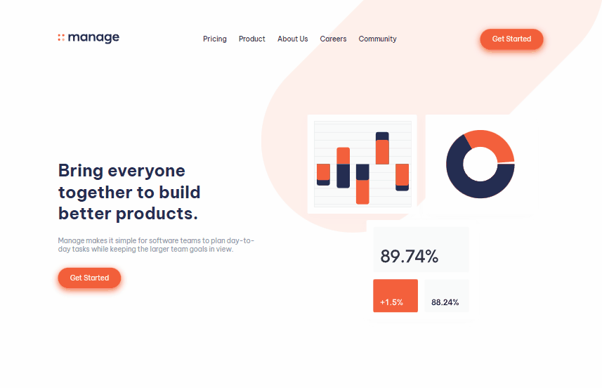
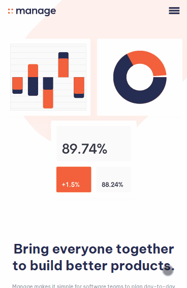

# Desafio Manage Landing Page - Frontend-Mentor

Este é um desafio de uma Landing Page para a Manage, proposto pelo site Frontend-Mentor.

## Tabela de Conteúdos

- [Visão Geral](#visão-geral)
    - [Imagens](#imagens)
    - [Link da página](#link)
- [Processo](#processo)
    - [Linguagens utilizadas](#linguagens-utilizadas)
    - [O que aprendi](#o-que-aprendi)
    - [Possíveis evoluções](#possíveis-evoluções)
- [Autor](#autor)

## Visão-geral

### Imagens

<br>

````
Versão de Desktop
````

   

<br>

````
Versão Mobile
````

 

### Link

- Página no GitHub Pages: <a href="https://julio-mansan2.github.io/manage-landing-page/">Clique aqui!</a>

## Processo

### Linguagens utilizadas

<br>

- Marcações semânticas de HTML5
- Propriedades de customização do CSS3
- Estruturas de JavaScript

<br>

### O que aprendi

<br>

- Criar um menu hambúrguer:

````html

<input id="menu__toggle" type="checkbox" />
<label class="menu__btn" for="menu__toggle">
<span></span>
</label>

````
````css

#menu__toggle {
        opacity: 0;
    }

    #menu__toggle:checked+.menu__btn>span {
        transform: rotate(45deg);
        background: var(--dark-blue);
    }

    #menu__toggle:checked+.menu__btn>span::before {
        top: 0;
        transform: rotate(0deg);
        background: var(--dark-blue);
    }

    #menu__toggle:checked+.menu__btn>span::after {
        top: 0;
        transform: rotate(90deg);
        background: var(--dark-blue);
    }

    .menu__btn {
        top: 40%;
        right: 5%;
        position: absolute;
        width: 2rem;
        height: 1rem;
        cursor: pointer;
        z-index: 2;
    }

    .menu__btn>span,
    .menu__btn>span::before,
    .menu__btn>span::after {
        display: block;
        position: absolute;
        width: 100%;
        height: 5px;
        background-color: var(--dark-blue);
        transition-duration: .25s;
    }

    .menu__btn>span::before {
        content: '';
        top: -8px;
    }

    .menu__btn>span::after {
        content: '';
        top: 8px;
    }

    .header .menu__box {
        position: absolute;
        top: 100%;
        width: 80%;
        background: hsl(0, 0%, 98%, 0.95);
        box-shadow: 0 8px 32px 50px rgba(31, 38, 135, 0.37);
        border-radius: 10px;
        border: 1px solid rgba(255, 255, 255, 0.18);
        left: -100%;
        padding: 1.8rem;
        align-items: center;
        flex-direction: column;
        transition-duration: .25s;
        text-align: center;
        z-index: 1;
    }

    .header .login-area {
        position: relative;
        flex-direction: column;
    }

    .aparecer {
        left: 10% !important;
    }


````

- Mover a classe entre objetos

````Javascript

const anishaTestimonial = document.querySelector('.anisha')
const aliTestimonial = document.querySelector('.ali')
const richardTestimonial = document.querySelector('.richard')
const shanaiTestimonial = document.querySelector('.shanai')
const anishaInput = document.getElementById('anisha')
const aliInput = document.getElementById('ali')
const richardInput = document.getElementById('richard')
const shanaiInput = document.getElementById('shanai')

anishaInput.addEventListener('click', function () {
    if (anishaInput.checked) {
        anishaTestimonial.classList.add('selecionado')
        aliTestimonial.classList.remove('selecionado')
        richardTestimonial.classList.remove('selecionado')
        shanaiTestimonial.classList.remove('selecionado')
    }
})

aliInput.addEventListener('click', function () {
    if (aliInput.checked) {
        anishaTestimonial.classList.remove('selecionado')
        aliTestimonial.classList.add('selecionado')
        richardTestimonial.classList.remove('selecionado')
        shanaiTestimonial.classList.remove('selecionado')
    }
})

richardInput.addEventListener('click', function () {
    if (richardInput.checked) {
        anishaTestimonial.classList.remove('selecionado')
        aliTestimonial.classList.remove('selecionado')
        richardTestimonial.classList.add('selecionado')
        shanaiTestimonial.classList.remove('selecionado')
    }
})

shanaiInput.addEventListener('click', function () {
    if (shanaiInput.checked) {
        anishaTestimonial.classList.remove('selecionado')
        aliTestimonial.classList.remove('selecionado')
        richardTestimonial.classList.remove('selecionado')
        shanaiTestimonial.classList.add('selecionado')
    }
})

````
<br>

### Possíveis evoluções

<br>

- Códigos mais compactos;
- Deixar a imagem do footer branca;
- Estilizar de forma mais precisa.

<br>

## Autor

GitHub - <a href="https://github.com/julio-mansan2">julio-mansan2</a> <br>
Front-end Mentor - <a href="https://www.frontendmentor.io/profile/julio-mansan2">julio-mansan2</a> <br>
LinkedIn - <a href="https://www.linkedin.com/in/j%C3%BAlio-a-mansan-3415a7249/">Júlio A.</a> <br>